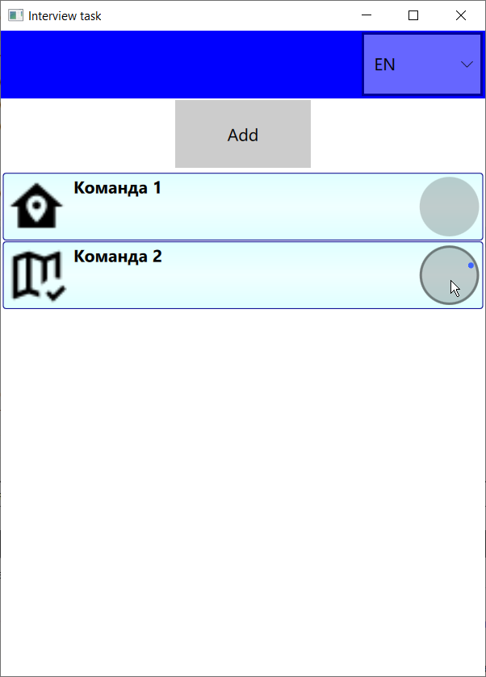
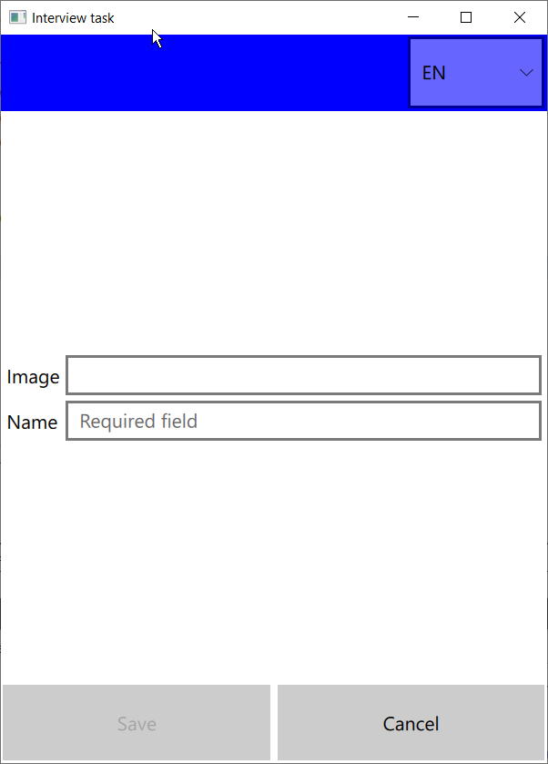

   

# interview_spb

<table style="padding:0; border:none;">
    <tr style="padding:0; border:none;">
        <td style="padding:2px; border:none;">
            
        </td>
        <td style="padding:2px; border:none;">
            
        </td>
        <td style="padding:2px; border:none;">
            
        </td>
    </tr>
</table>
